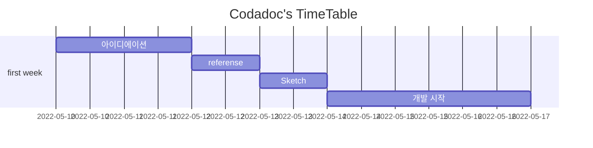

배고파(Vegopa)
===

외롭고 배고픈 이들을 위한 맛집 추천 커뮤니티 앱 입니다. 


## 목차

- [배고파(Vegopa)](#----vegopa-)
  * [목차](#--)
  * [🎯 Project's Goal](#---project-s-goal)
  * [📌 Getting Started](#---getting-started)
  * [🛠 Dependency](#---dependency)
  * [📈 User flows](#---user-flows)
  * [🕠 Project Timeline](#---project-timeline)
  * [🌈 Members](#---members)

## 🎯 Project's Goal

현대인에게 매일 따라 다니는 "밥 뭐먹지?" 라는 고민에 다양한 솔루션을 주는 어플리케이션.
<br/>
혼자 먹을 건지, 다른 사람과 같이 먹을 건지 혹은, 밥먹으면서 재밌게 메뉴를 추천받을 건지 여러 사용자들의 성향에 따라 각자의 방법으로 메뉴를 추천 받을 수 있는 어플리케이션.


## 📌 Getting Started
```
yarn run dev 

npm run dev

//build

yarn build

npm run build
```

## 🛠 Dependency

   

  
   
   


📈 User flows
---
- Flow 1 
    - target : 혼자 밥을 먹으려했으나 어떤 것이 먹고싶은 지 모르는 사람
    - 나의 취향대로 몇가지 질문에 답을 한 뒤, 그 취향에 맞는 음식들 중에 하나를 랜덤으로 골라준다. 취향을 입력하기 귀찮은 사람이라면 바로 랜덤음식을 추천해 줄 수 있다.


- Flow 2
    - target : 내가 먹고싶은 음식이 무엇인지 고민하고있고, 뭔가 혼자먹기는 싫은 사람.
    - 주변에서 밥을 같이 먹고싶어하는 새로운 사람들과 커넥션하며 앱에서 골라준 음식을 먹으러 같이 간다.


- Flow 3
    - target : 밥을 먹을 때 심심하여 친구들과 같이 공유할만한 오락이 필요한 사람.
    - 음식 MBTI 를 설문을 하면서 밥이 나오길 기다린다. 결과창을 친구들과 함께 공유하면서 재미를 즐긴다.


<br/>

🕠 Project Timeline
---


## 🌈 Members


|이몬|세인트|라이언|모승|정|
|---|---|---|---|--|
||||||
|[eamon3481](https://github.com/eamon3481)|[Seongtaek](https://github.com/Seongtaek-H)|[Luceta](https://github.com/Luceta)|[endmoseung](https://github.com/endmoseung)|[jlee0505](https://github.com/jlee0505)|


